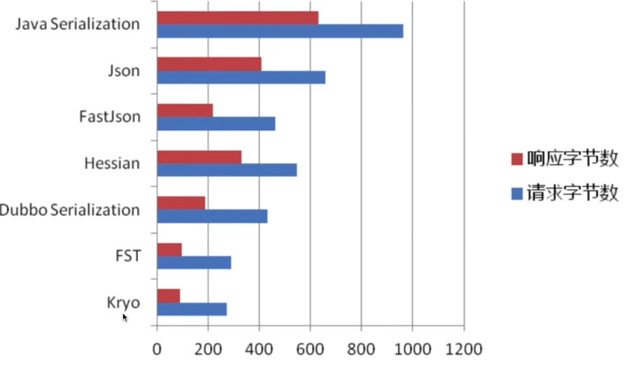
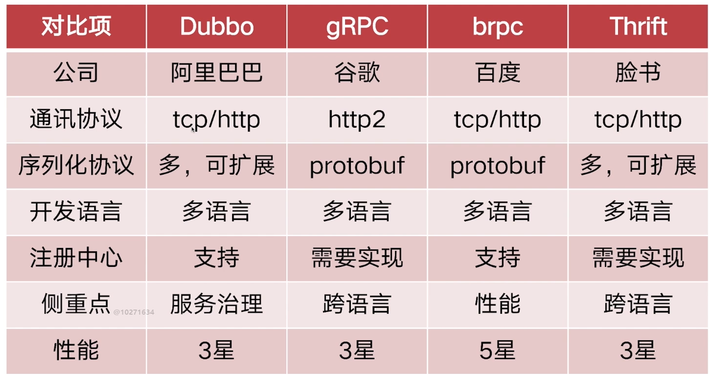
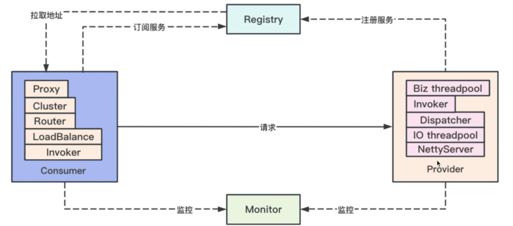
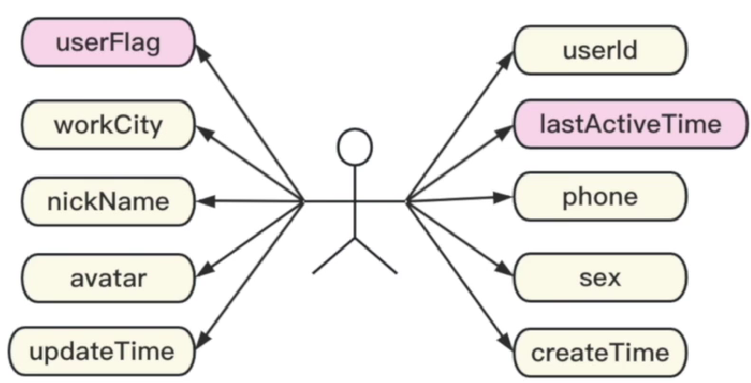
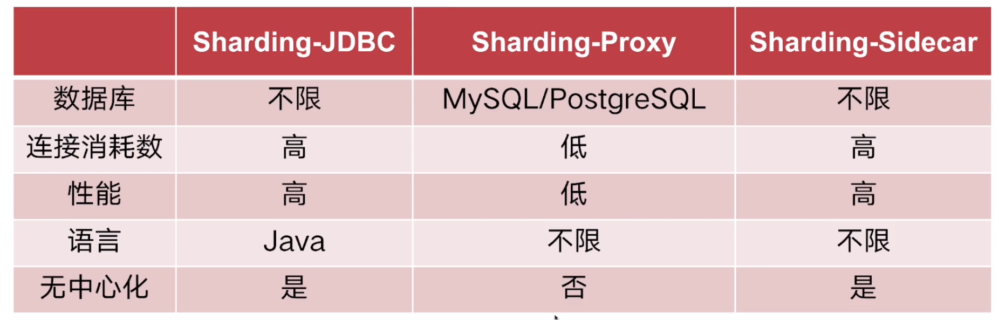
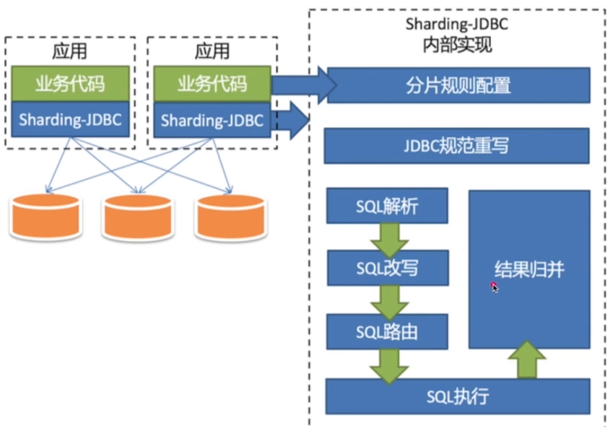
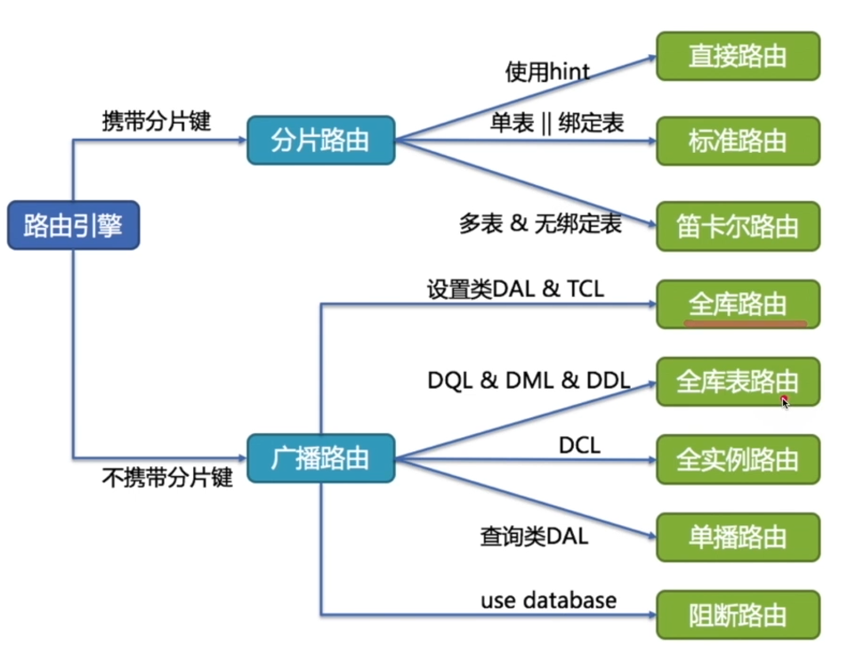

# 用户中台项目
## 功能介绍
1. 单用户查询
2. 批量用户查询
3. 用户资料更新
4. 用户登录注册

## 具体分析
##### 单用户查询
本地缓存？

结合业务场景分析，如果热数据很多的话不建议使用本地缓存，因为本地缓存空间有限，热数据频繁变更会导致本地缓存不断触发缓存淘汰

redis？
采用string类型存储，其他类型可能会造成大key问题

序列化？
数据存储到Redis需要做序列化处理，选择性能好的序列化器很重要

选择FST和Kryo

数据量过大？
数据库中数据量过大，数据库性能会降低。可采用分库分表

##### 批量用户查询
批量查询可能会导致，缓存命中率过低。

如果是热点数据，如何从Redis中查询?

一个一个key去查找可能会损耗网络IO，采用Redis中multiGet命令，批量查询

不是热点数据，如何从数据库查？分库分表如何查？

使用ShardingJDBC的批量查询，会按照片键往不同的表里发送in查询SQL，最后统一汇聚

##### 用户更新
缓存一致性？
先删再更？先更再删？

解决：
1. 延迟双删
2. 基于订阅binlog去删除缓存

##### 用户注册
用户id生成？

mysql自增id的问题：
1. 爬虫
2. 表的迁移

推荐：随机无序

## 远程服务访问
采用什么方式？
1. http
2. rpc

二者区别？
RPC更多是一套完整地远程服务调用的实现方案；而Http则只是一种网络通信协议。二者不是一个维度的概念

Http：
1. 协议头非常多
2. 体积大
3. 跨语言
4. http2.0以后长连接，Http2.0后请求头进行了压缩

RPC：
1. 可以自定义协议体
2. 体积更小，速度更快
3. 跨语言
4. 长连接

rpc核心协议：
1. 通信协议：Http（grpc），tcp（Dubbo）
2. 序列化协议：Hessian，Json，Xml，protobuf

RPC产品：
1. Dubbo
   2. SPI机制支持可扩展，多序列化协议
   3. 服务治理手段丰富
2. gRPC 
   3. Http2.0
   4. protobuf序列化
3. bRPC（百度）
   4. 性能强
4. Thrift（FaceBook）

Dubbo整体架构

## 用户属性

**用户**：
其中部分字段读写频率非常高，而部分字段的频率非常低
设计的时候尽量做到冷热字段分离

## 分库分表
分库分表的具体考量
1. 根据表结构预估数据的存储容量
2. 100张分表/单表预计上限在100W
3. 性能预估
   4. CPU
   5. 连接数
   6. 存储空间
   7. 内存
   8. IOPS（吞吐量、每秒的读写次数）
   9. 带宽

分表产品比较：

## ShardingJDBC
原理架构：

### 路由
1. 直接路由 
2. 标准路由 
3. 笛卡尔积路由 
4. 全库路由 
5. 全实例路由 
6. 全库表路由
7. 单播路由
8. 阻断路由

### 归并
将多个查询的结果集进行汇总的功能实现

分类：
1. 遍历归并
2. 排序归并
3. 分组归并
4. 聚合归并

使用ShardingJdbc之后，尽量使用简单查询类型的SQL，少用分组查询
聚合函数。对于分页查询要谨慎使用，避免产生全表扫描的情况
